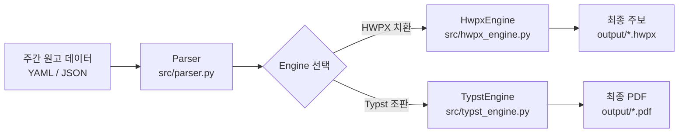

# Sunday Bulletin 시스템 아키텍처 (Architecture)

## 1. 개요 및 파이프라인
Sunday Bulletin은 매주 주보 작성에 소요되는 시간을 단축하고, 기존 한글 서식 보존과 최신 초고속 조판(Typst) 출력을 지원하는 자동화 파이프라인입니다.

## 2. 모듈 구성
- **`src/parser.py`**: 주간 원고(YAML/JSON)를 읽어 정형 딕셔너리 구조로 반환.
- **`src/hwpx_engine.py`**: `.hwpx` 템플릿(Zip/XML)을 언팩 후 텍스트 태그(`{{KEY}}`)를 치환하고 재패키징.
- **`src/typst_engine.py`**: Typst 소스를 기반으로 한글 조판 헬퍼(장평, 배분)를 적용하여 PDF 컴파일.
- **`src/main.py`**: CLI 진입점.

## 3. 디렉터리 역할
- **`templates/`**: 서식 원본 템플릿 보관.
- **`data/`**: 입력 원고 데이터 (`samples/`, `inputs/`).
- **`output/`**: 빌드된 결과물 저장소.
- **`.agents/`**: 다중 AI 도구 및 개발자를 위한 로컬 스킬/규칙 원본.
